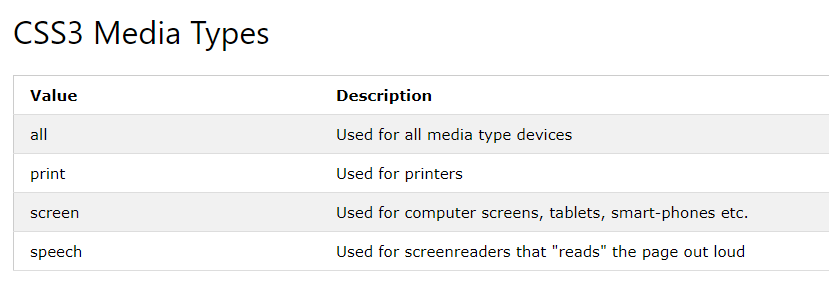

# [Tvořím web od A do Z](https://github.com/czechitas/tvorim-web-a-z): Podklady pro 7. lekci

## Shrnutí lekce

### Sémantické značky

Sám sice přesně nevím, co _[sémantika](https://cs.wikipedia.org/wiki/S%C3%A9mantika)_ je, jsem přeci jen vyučený číšník a neúspěšný herec :) , ale snažím se používat značky s významem. Při psaní strukury HTML dokumentu se ptám, co je to za část stránky, co představuje? Bude to běžný text, poznámka pod čarou, seznam, článek, navigace atd.? A podle toho volím značku. Pouze tehdy, kdy se žádná nehodí, použiju neutrální `div` (blokový), nebo `span` (řádkový). Naopak, pokud potřebuji do HTML přidat prvek, abych mohl dosáhnout kýženého stylu, například potřebuji vytvořit flexboxový kontejner, přidám `div`.

[Přehled HTML značek](https://websitesetup.org/html5-periodical-table/)

### HTML entity

Všechny myšlené znaky (písmena, číslice, klikyháky, emotikony) se dají v HTML vyjádřit kódem, tzv. entitou. Například `š` lze zapsat jako `&scaron;`. S tím, že HTML entita vždy začíná `&` a končí `;`. Mezi nimi je buď pojmenovaná entita, jako v příkladě výše, nebo číselný kód. Pozor, na velikosti písmen záleží (`&scaron;` = š, `&Scaron;` = Š).

Dnes, když je kódování UTF-8 plně rozšířeno, ztrácejí entity na významu. Zůstává nám nejčastěji nezalomitelná (pevná mezera) `&nbsp;` (Non-Breaking SPace). Tu bychom například v českých textech měli používat vždy za jednopísmennými předložkami. Nebo mezi číslem a jednotkou (neplatí pro CSS!).

Nově se entity vracejí na scénu v podobě populárních emoji, např. `&#128567;` = 😷

[Přehled HTML entit](https://www.w3schools.com/html/html_entities.asp)
[Jiný přehled týchž HTML entit](https://www.toptal.com/designers/htmlarrows/symbols/)

### Metodika názvů tříd

Programátorská lidová moudrost praví, že _dva největší problémy při programování jsou invalidace cache, pojmenování věcí a chyby o jedničku_.  Nás se při psaní HTML a CSS týká hlavně pojmenování, konkrétně pojmenování tříd. Existuje celá řada metodik, jak k psaní tříd přistupovat. Jednou z nejpopulárnějších je [metodika BEM](https://www.vzhurudolu.cz/prirucka/bem). My jsme si ukázali tzv. modifikátor. Tedy třídu, která zahrnuje CSS pravidla, kterými se daný prvek odlišuje od ostatních jemu podobných. V BEMU se pro označení modifikátoru používají dva spojovníky `--`, např.: `.recept--hlavni`. To pro tuto chvíli stačí.

Podstatnější je, že v současnosti se doporučuje přidávat všem prvkům třídy a stylovat přes ně. Jednou z výhod tohoto přístupu je, že případná změna HTML prvků nemá vliv na CSS. Že se HTML nebude měnit? O co, že jo?!

### Délkové jednotky v CSS

Délkových jednotek v CSS je celá řada. Z nich nejběžnější jsou `px`, `%`, `vw`, `rem` a `em`. Zatímco o pixelech se často mluví jako o jednotkách absolutních (není to tak úplně pravda, ale to v tuto chvíli nevadí) a těch ostatních jako o relativních.

Obecně se snažíme používat relativní jednotky pro velikosti písma – `rem`, `em` a rozměry prvků (s výjmkou obrázků) – `%`, `vw`. Proč? Weby lze dnes zobrazit na obrovském množství různě velikých zařízení. Proto určujeme velikosti písem a rozměrů jednotlivých prvků jen poměrně, a výpočet výsledné velikosti v pixelech ochotně necháme na prohlížeči.

Naproti tomu `px` se hodí více pro obrázky nebo tloušťku orámování. Proč? Obrázky (JPG, PNG, GIF) jsou de facto mozaiky pixelů, barevných bodů uspořádaných v řadách a sloupcích. A jejich rozměry chci mít více pod kontrolou, aby obrázky nebyly šišaté nebo rozmazané.

[Online převodník `px` => `rem`](https://www.ninjaunits.com/converters/pixels/pixels-rem/) (prostě trojčlenka)

### Dědičnost v CSS

Dotkli jsme se dědičnosti. Což je významná vlastnost jazyka CSS. Ovšem pozor, zdaleka ne všechny vlastnosti se dědí. Těch dědičných je spíše menšina a týkají se obvykle písma (jeho barva, velikost, tučnost atp.). Naopak vlastnosti box modelu (`display`, `width`, `margin`, `padding`, `border`) se nedědí. Ono by to ani nedávalo smysl, kdyby se například ohraničení projevilo na všech zanořených prvcích.

[Článek o dědičnosti](https://www.vzhurudolu.cz/prirucka/css-dedicnost) na Vzhůru dolů

### Typy médií v CSS

Nejběžnějším typem je `@media screen`, tedy styly pro obrazvku. Dále se často používá pro vyčlenění tiskových stylů `@media print` (rušíme v nich se nastavení barev, skrývají se záhlaví a zápatí webu atp. aby vytištěná stránka odpovídala danému médiu, papíru). S tím si vystačíte na většinu běžných situací.



### Práce s editorem

Editor je náš základní nástroj, pokud ho ovládneme, ušetří nám spoustu úmorného psaní. Hlavní pozornost věnujte osvojení klávesových zkratek (postupně, nechtějte toho moc naráz) a využití několikanásobného kurzoru. To je funkce všech moderních editorů, která umožňuje psát na více místech naráz. Což je při psaní kódu velmi užitečné.

Návody a ukázky:

O vícenásobných kurzorech: https://code.visualstudio.com/docs/editor/codebasics#_multiple-selections-multicursor
Pokročilé vyhledávání v kódu: https://code.visualstudio.com/docs/editor/codebasics#_find-and-replace

### Emmet

Využívejte naplno rozšíření emmet, které píše kód za vás. Dobře, ne úplně, ale víc než z poloviny určitě. I když se nejčastěji předvádí použití v HTML, cennější je dle mého soudu při psaní CSS. Místo vypisování vlastností stačí často uvést jen počáteční písmena + číslo (hodnotu). Tabelátor doplní vše potřebné.

```
m10 → margin: 10px;
m1r → margin: 1rem;
p.5r1r → padding: 0.5rem 1rem;
pl.5r → padding-left: 0.5rem;
```

U některých vlastností to nejsou přímo počáteční písmena, ale i tyto zkratky vám přejdou rychle do krve:

```
bd ~ border
bg ~ background
fz ~ font-size (fs ~ font-style)
bdrs ~ border-radius

fz1.2r → font-size: 1.2rem;
bgc#4 → background-color: #444444;
bd → border: 1px solid #000; /* dalším stisknutím tabelátoru přeskakujete na dílčí hodnoty */
```

Emmet ve VS Code: https://code.visualstudio.com/docs/editor/emmet
Zkratky v Emmetu (CSS v polovině stránky) https://docs.emmet.io/cheat-sheet/